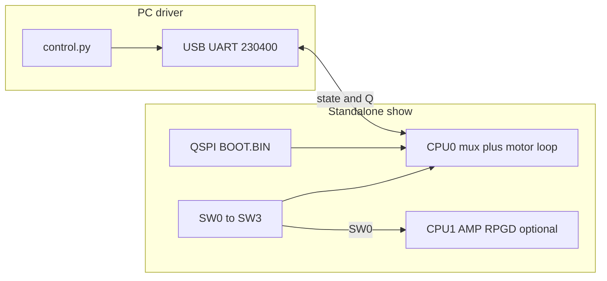

# Architecture

How the physical-cartpole repository fits together: software layout, runtime
paths, and where configuration must stay in sync. For day-to-day use see
[operating.md](operating.md). Simulation and training live in the
[CartPoleSimulation README](../Driver/CartPoleSimulation/README.md) — not
duplicated here.

## Repository map

| Path | Role |
|---|---|
| [Driver/](../Driver/) | PC host: `control.py`, UART, logging, experiment protocols |
| [Driver/globals.py](../Driver/globals.py) | PC-side defaults (chip, controller, motor, timing) |
| [Driver/CartPoleSimulation/](../Driver/CartPoleSimulation/) | Submodule: simulator, MPC data gen, SI_Toolkit training |
| [Firmware/](../Firmware/) | CartPoleFirmware (STM + Zynq), build scripts, Vitis projects |
| [FPGA/](../FPGA/) | Vivado block designs, bitstreams, custom IPs |
| [examples/models/](../examples/models/) | Preserved deployable network bundles + validation |
| [Docs/](.) | User documentation |
| [tools/slider_pmod/](../tools/slider_pmod/) | JB slider calibration utilities |

## Runtime paths

| Path | Who controls the motor | Typical use |
|---|---|---|
| QSPI + switches | On-chip controller from SW0–SW3 | Lab show, demos |
| `control.py` + **`u`** | Same on-chip controller; PC logs / sets targets | Monitor, CSV, live plot |
| `control.py` + **`k`** | Python `CONTROLLER_NAME` | Research, MPC, neural-imitator on host |
| STM32 + USER button | On-chip PID | Original STM robot |

PC **`k`** and on-chip **`u`** are mutually exclusive in firmware.

## Dual-core AMP (show image)

On the Development Zybo show firmware:

* **CPU0** — FSBL-loaded app `CartPoleFirmware_rpgd_amp_cpu0.elf`: sensor loop,
  show mux (SW0–SW3), motor output, UART to PC, starts CPU1.
* **CPU1** — RPGD worker blob linked into CPU0; active when **SW0** selects
  AMP RPGD (~20 ms NMPC).

Do not pack a second standalone ELF or `destination_cpu` in the BIF; CPU0 copies
the CPU1 image into DDR and releases it.

## Configuration sync

These must agree for predictable behavior:

| Setting | PC | Firmware |
|---|---|---|
| Chip / board | `Driver/globals.py` `CHIP`, `ZYNQ_BOARD` | `hardware_bridge.h` `ZYNQ` / `STM`, `ZYBO_Z720` |
| Slider interface | `USE_EXTERNAL_INTERFACE` | `#define USE_EXTERNAL_INTERFACE` |
| Show mux | `SHOW_SWITCH_MUX` | Compiled for Zybo Z7-20 in `controller_profiles.c` |
| Hanging angle | `ANGLE_HANGING_*` in `globals.py` | `parameters.c` |
| Angle circle | `ANGLE_360_DEG_IN_ADC_UNITS` | `parameters.c` |
| Motor map | `MOTOR_CORRECTION_*` | `parameters.c` `MOTOR_CORRECTION` |
| Motor type default | `MOTOR` | `parameters.c` / calibration RAM |

After **`K`** / track calibration, hanging is unchanged. After **BTN0**, the
chip may lock hanging for the boot (QSPI save); the PC adopts it on connect.

## Sim → train → deploy (pointers only)

1. **Simulate / generate data** — [CartPoleSimulation README](../Driver/CartPoleSimulation/README.md): GUI, `run_data_generator.py`, ML pipeline.
2. **Train / export** — SI_Toolkit in the submodule; C export via `Convert_Network_To_C.py`.
3. **Deploy on robot** — copy weights into `Firmware/Src/General/NC_C/` or PL
   bitstream; set `config_controllers.yml` / `CONTROLLER_NAME`; align motor and
   angle constants; see [examples/models/README.md](../examples/models/README.md)
   and [pc-driver.md](pc-driver.md).

## Research-only paths

Not used on the Development Zybo show default:

* [SecLoc_Experiment_Platform.md](SecLoc_Experiment_Platform.md) — Zedboard /
  SecLoc2026 branch
* DVS / EKF flags in `globals.py`
* [SecLoc PL integration report](SecLoc_PL_Integration_Report.md)
