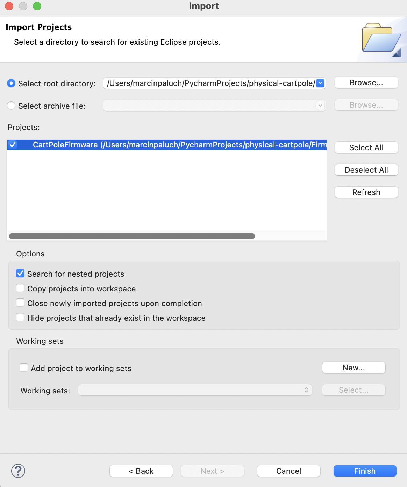
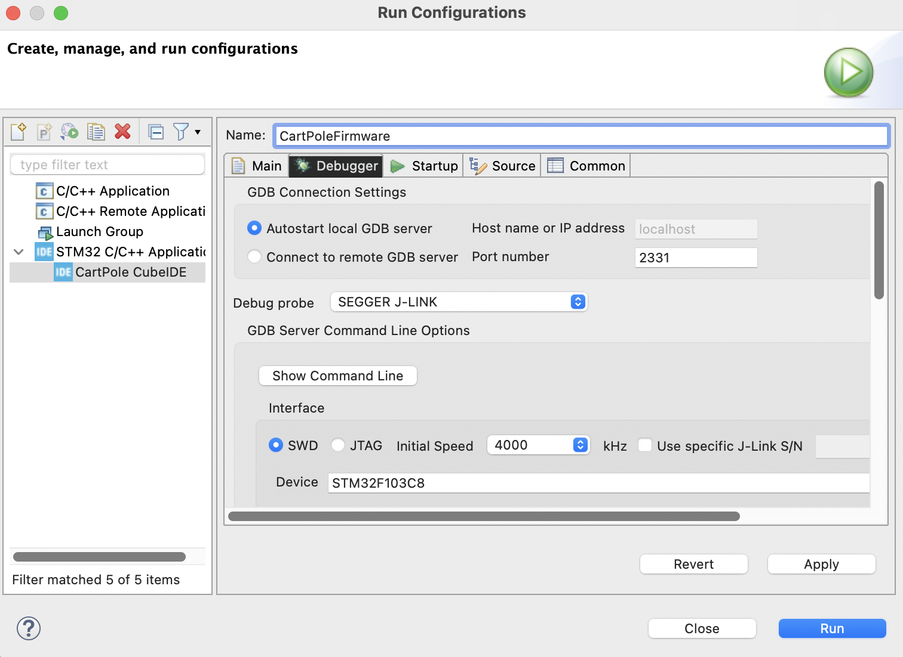

# Firmware and flashing

Programming the Zybo show image, STM32 path, and optional FPGA/Vitis rebuild.
Daily operation is in [operating.md](operating.md). Script details:
[Firmware/README.md](../Firmware/README.md).

## Standalone / QSPI (no PC at power-up)

Hardcode hanging and motor map in `parameters.c` first, or press BTN0 after each
boot. Prove the same image on JTAG before flashing.

The show `BOOT.BIN` is secloc2026 FSBL +
`FPGA/bitstreams/cartpole_short_pole_secloc.bit` + AMP CPU0
(`CartPoleFirmware_rpgd_amp_cpu0.elf`). CPU0 starts CPU1. Image-range erase
only — **do not erase the entire 16 MiB** or you wipe hanging at `0xFD0000` /
`0xFFF000`.

1. JP5 = **JTAG**. Close Vitis. Build if needed:
   `RPGD_AMP_PRODUCTION=1 Firmware/Scripts/build_rpgd_amp_elfs.sh`
2. `Firmware/Scripts/program_show_qspi.sh`
   (uses [program_qspi_boot.tcl](../Firmware/Scripts/program_qspi_boot.tcl);
   template BIF: [cartpole_qspi.bif](../Firmware/Scripts/cartpole_qspi.bif)).
3. Power off. JP5 = **QSPI**. Power on. Hang, BTN0, BTN4, exactly one of SW0–SW3.

### Standalone / microSD fallback

With the FAT card mounted on the PC (the lab card is labeled `SD_Zybo`):

```console
Firmware/Scripts/install_show_sd.sh
```

The script rebuilds the same show image, writes it as `BOOT.BIN` at the card
root, and verifies the copy. It does not partition or format the card. Safely
eject it, insert it in the Zybo, set JP5 to **SD**, and power-cycle. The
BootROM loads the FSBL from SD; that FSBL still loads the bitstream and AMP
CPU0, and CPU0 starts CPU1 exactly as in QSPI boot.

### Safety on the show image

* Motor output is latched off until BTN4 / `u` / `k`
* Stall: significant command with almost no encoder travel for 100 ms → command 0
* Position limits brake with a margin before the encoder range ends
* Invalid / bouncing DIP: Q = 0 for that tick

### PL buttons in the bitstream

PL buttons need a platform whose `xparameters.h` lists `PL_BUTTONS_GPIO`.
Source of truth:
[FPGA/VivadoProjects/CartpoleDriverZynq_AXIS_12_09_2025.tcl](../FPGA/VivadoProjects/CartpoleDriverZynq_AXIS_12_09_2025.tcl).
To patch an existing secloc project:
[add_pl_buttons_and_build.tcl](../FPGA/VivadoProjects/add_pl_buttons_and_build.tcl),
then import `FPGA/VivadoProjects/cartpole_zybo_pl_buttons.xsa` and refresh
`cartpole_zybo_secloc2026`. Old bit + new firmware still boots; BTN0 does
nothing until that XSA is imported.

## Daily programming (JTAG vs QSPI)

| Goal | JP5 | Command |
|---|---|---|
| Run from RAM (dev) | JTAG | `Firmware/Scripts/program_rpgd_amp_production.sh` |
| Flash for standalone boot | JTAG while flashing | `Firmware/Scripts/program_show_qspi.sh` |
| Boot from flash | QSPI (center pins) | Power cycle after flash |
| Install SD fallback | Card mounted on PC | `Firmware/Scripts/install_show_sd.sh` |
| Boot from SD | SD | Insert card and power-cycle |

Close Vitis before JTAG flash — it steals the probe. Flashing with JP5 on QSPI
stalls (`BOOT_MODE` is then 1).

## STM32

STM remains a supported chip (`#define STM`, `CHIP = "STM"`). On-chip control is
PID. The USER button (`KEY_5` / `BUTTON_1`) toggles it the same way as PC `u`.
Track calibration and hanging capture are **not** wired to STM extra buttons
(`BUTTON_2` / `BUTTON_3` are unused); use the PC (`K`, `b`).

Setup:

* Connect ST-Link or J-Link. The J-Link picture applies to ST-Link; the
  connector is the same.
  
* STM32CubeIDE → `File -> Import... -> Existing Projects into Workspace` →
  [Firmware/CubeIDE/CartPoleFirmware](../Firmware/CubeIDE/CartPoleFirmware).
  
* In `hardware_bridge.h`: comment `#define ZYNQ`, uncomment `#define STM`.
* Build, then `Run As -> STM32 C/C++ Application`. Debugger tab: your probe.
  
* STM firmware lives in flash and overwrites the factory image. Save the
  original first if you still need it.
* `Driver/globals.py`: `CHIP = "STM"`

PID does not swing up. Do not arm with the pole far from vertical or the cart
will hit the ends. The reset button reloads flash.

The old factory-firmware PC module, board mode buttons, and
“calibrate automatically on first enable” behavior do **not** apply to this
firmware.

## FPGA and Vitis rebuild

You do **not** need this for daily show use. Prebuilt bitstream:
[FPGA/bitstreams/cartpole_short_pole_secloc.bit](../FPGA/bitstreams/cartpole_short_pole_secloc.bit).
Platform: `Firmware/VitisProjects/cartpole_zybo_secloc2026`.

Tools: **Vivado / Vitis 2020.1** (`source /tools/Xilinx/Vivado/2020.1/settings64.sh`).

Recreate the Zybo block design from
[FPGA/VivadoProjects](../FPGA/VivadoProjects):

```tcl
cd FPGA/VivadoProjects
source ./CartpoleDriverZynq_AXIS_12_09_2025.tcl
```

Generate bitstream, export hardware (**Fixed**, include bitstream), import the
XSA into the `cartpole_zybo_secloc2026` Vitis platform and refresh both
standalone domains. AMP CPU1 domain:

```console
xsct Firmware/Scripts/setup_rpgd_amp_platform.tcl
```

Production ELFs (CPU1 blob linked into CPU0):

```console
RPGD_AMP_PRODUCTION=1 Firmware/Scripts/build_rpgd_amp_elfs.sh
```

Related TCL: `add_pl_buttons_and_build.tcl`, `set_pmodad1_timing_and_build.tcl`,
`swap_nn_and_build.tcl`, Zedboard `CartpoleDriverZynq_AXIS_Zedboard.tcl`.

To snapshot a live Vivado project:

```tcl
write_project_tcl -force ./zybo_new.tcl
```

SecLoc (Zedboard / research, not the Development show default):
[SecLoc_Experiment_Platform.md](SecLoc_Experiment_Platform.md),
[FPGA/CustomIPs/README_secloc_chain.md](../FPGA/CustomIPs/README_secloc_chain.md).
`USE_SECLOC` / `USE_CHIP_SECLOC` stay **False** on Development Zybo.

There is no legacy top-level FPGA folder and no exported Vitis zip in this tree.
Recreate from `FPGA/VivadoProjects` as above.

On-chip timing harness (motor off):
[Firmware/Src/Embedded_Controller/TIMING_TEST_README.md](../Firmware/Src/Embedded_Controller/TIMING_TEST_README.md).
