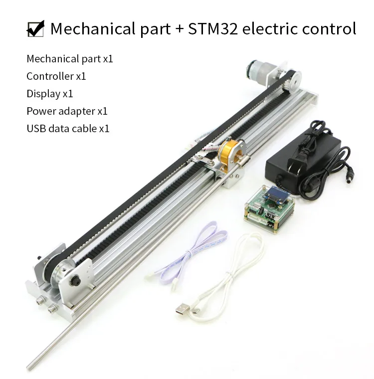
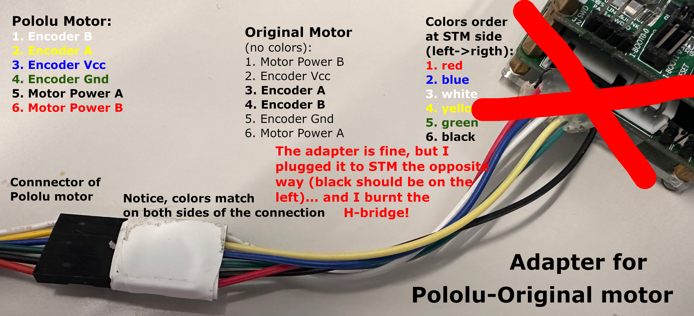
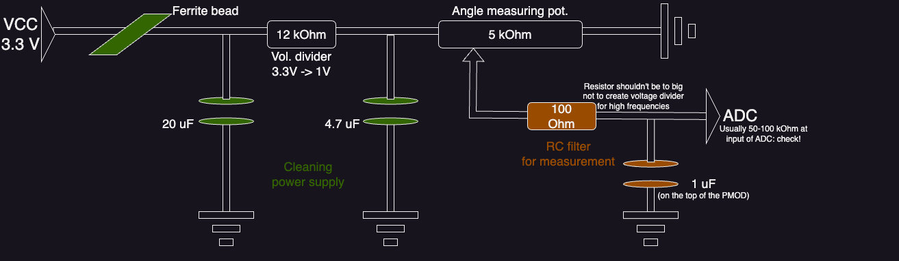
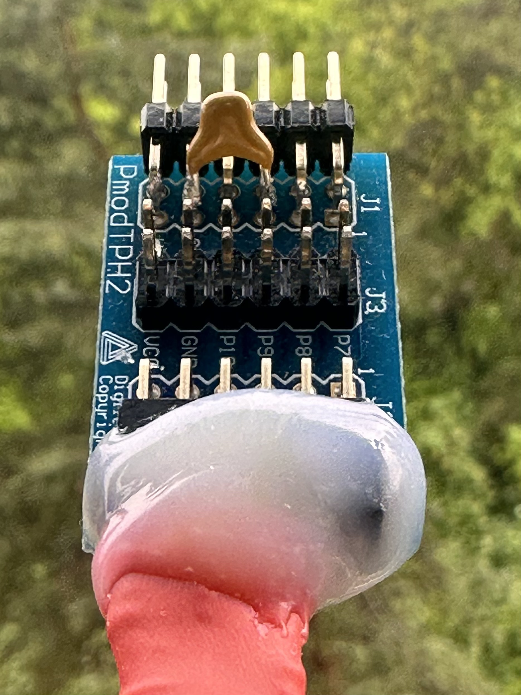

# Hardware

Mechanical assembly, Zybo PMODs, motors, and the JB slider. For flashing and
FPGA rebuild see [firmware-and-flash.md](firmware-and-flash.md). For calibration
after assembly see [calibration.md](calibration.md).

## BOM in short

To operate the cartpole, beyond the robot itself (see [Original setup](#original-setup)):

* If you want to use it with STM32:
  * Buy the cartpole **with STM32 board**.
  * STM32 programmer (ST-Link or J-Link)
* If you want to use it with Zybo-Z7-20:
  * [Zybo-Z7-20 board](https://digilent.com/shop/zybo-z7-zynq-7000-arm-fpga-soc-development-board/)

     We use Zybo-Z7 **-20**. The current design consumes over half of the FPGA.
     A smaller or larger Zynq needs pin, button, LED, and switch remapping.
  * Analog filter with voltage divider for the angle ADC, and an H-bridge for the motor:
      * 12 V, 5 A power supply for the motor (usually ships with the robot)
      * 2 × [Pmod TPH2](https://digilent.com/shop/pmod-tph2-12-pin-test-point-header/)
        (H-bridge and analog filter)
      * H-bridge: [Pololu TB6612FNG](https://www.berrybase.ch/pololu-tb6612fng-dualer-motortreiber)
      * 1 × ferrite bead (potentiometer supply)
      * Capacitors: 1 µF (angle RC, τ ≈ 0.1 ms), 20 µF and 4.7 µF (potentiometer
        supply), 470 µF (H-bridge supply, optional)
      * Resistors: 12 kΩ divider, 100 Ω in the angle RC
      * Wires; barrel connector on the H-bridge
* Also useful:
    * Long micro-USB cable (1–2 m)
    * Spare motor **with encoder**: Pololu 19:1 Metal Gearmotor 37Dx68Lmm 12 V,
      64 CPR [#4751](https://www.pololu.com/product/4751)
    * Zybo 5 V, 2.5 A barrel supply (USB power also works)
    * Zybo on-board QSPI — supported standalone boot. JP5 on the two center pins
      labeled QSPI. Image: [Firmware/Scripts/cartpole_qspi.bif](../Firmware/Scripts/cartpole_qspi.bif)
    * SD card — optional fallback (`BOOT.BIN` on the card, JP5 = SD)
    * Spare STM boards if you work mostly with them
    * Metal bars for other pole masses/lengths (mounting hole ~6 mm, pole ~5.7 mm)

## Original setup

We bought the robot on AliExpress
([example listing](https://de.aliexpress.com/item/1005004322352088.html)).
Search for “inverted pendulum” and match the picture. We have the STM32
(ST32F103C8T6) version, **not** Arduino. For Zybo-only use, the mechanical
assembly plus a motor supply is enough.

### Belt tension

Tight enough that the belt does not slip on the motor pulley, not so tight that
it side-loads the motor. A practical check: pushing the upper belt down should
just meet the lower belt and then go taut.

## Motors

Replacement motor: Pololu 19:1 37Dx68Lmm 12 V with 64 CPR encoder
[#4751](https://www.pololu.com/product/4751). Similar dynamics to the original;
the connector wire order differs. On STM the original motor is the firmware
default; Pololu needs the adapter below.

The same adapter (male/female reversed) should port the original motor to Zybo,
with the taped end on the Zybo side and STM-equivalent color mapping on the
motor end. That Zybo wiring has **not** been tried on the lab robots.

The Pololu-plus-adapter encoder sign is reversed versus the original motor.
Track calibration uses that to distinguish motors.

## Custom PMODs for Zybo-Z7-20

### H-bridge

Digilent H-bridge PMODs do not meet this motor. The STM robot uses TB6612FNG;
we solder the Pololu module to a Pmod TPH2. Plug it into **JE**. Wire colors
match the Pololu motor connector. Barrel is 12 V, 5 A.

### Analog filter

The potentiometer is 3.3 V; Zynq XADC is 0–1 V, so a divider plus RC is required.
Angle is PIN 3 of **JA**.

The visible 1 µF is the angle filter; it is easy to swap to change τ.
Glue helps the wiring survive cart motion.

From top to bottom: ferrite bead, 20 µF on the potentiometer supply, pin 9
shorted to ground. Other parts are under heat-shrink.

### Target-position slider (JB)

A Pmod slider on **JB** (PmodAD1) sets `target_position` when
`USE_EXTERNAL_INTERFACE` is defined in
[hardware_bridge.h](../Firmware/Src/CartPoleFirmware/hardware_bridge.h)
(default on Development). Firmware maps ADC affinely between the parked rails
(electrical mid = 0). The ends are ±`SliderTargetHalfLength` (**0.12 m**, inside
the 0.198 m track half-length). The driver displays the chip target and does
not send `CMD_SET_TARGET_POSITION`.

PmodAD1 must be built with SPI counts **40/120/1000/800** at 100 MHz.
Calibration and check scripts: [tools/slider_pmod/README.md](../tools/slider_pmod/README.md).
Close the GUI before a UART slider check (230400, Digilent interface 1).
